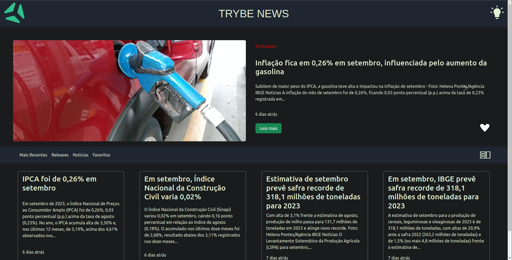
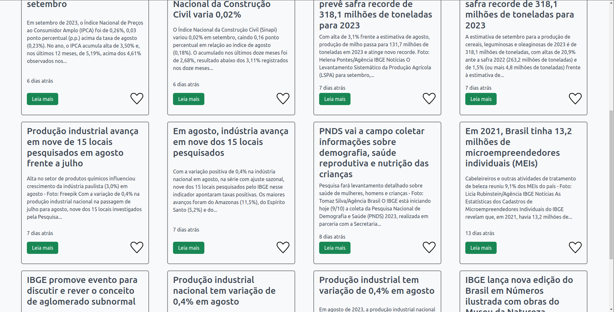
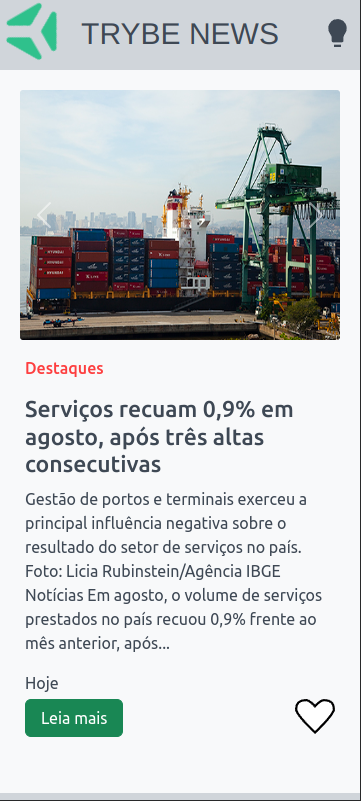
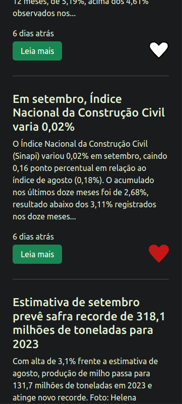

# Trybe App
Esse é um projeto criado com as principais tecnologias utilizadas no módulo de front-end da [Trybe](https://betrybe.com/).


<br>
<br>

<br>
<br>




## Link da aplicação
[Trybe News - Uma aplicação em React](https://trybe-news-react.vercel.app/)


## Instalação

Para executar esta aplicação, siga os passos abaixo:

1. Faça um clone do repositório:

   ```bash
   git clone https://github.com/seu-usuario/seu-repositorio.git
   ```

2. Navegue para o diretório do projeto:

   ```bash
   cd seu-repositorio
   ```

3. Instale as dependências usando o npm (Node Package Manager):

   ```bash
   npm install
   ```

4. Inicie a aplicação:

   ```bash
   npm run dev
   ```


## Contribuição

Estou aberto a contribuições para melhorar este projeto. Se você deseja contribuir, siga estes passos:

1. Faça um fork do repositório.

2. Crie uma branch para a sua contribuição:

   ```bash
   git checkout -b minha-contribuicao
   ```

3. Faça as alterações necessárias e adicione os commits.

4. Envie as alterações para o seu fork:

   ```bash
   git push origin minha-contribuicao
   ```

5. Crie um pull request para a branch principal do projeto.

<h3 align=center > Ou então entre em contato comigo!! </h4>

## Issues

Se você encontrar problemas ou tiver sugestões para melhorias, sinta-se à vontade para abrir uma **issue** no repositório. Certifique-se de fornecer informações detalhadas para que eu entenda o problema ou a sugestão e trabalhar para resolvê-lo.


## Gist do Projeto
Confira [esse link](https://gist.github.com/feduarte-dev/fdeed18cce3fc52fbf74e299b370923a).

## Responsividade

O projeto foi cuidadosamente projetado para se adaptar a diferentes resoluções de tela, proporcionando uma experiência de usuário excepcional em qualquer dispositivo. Levei em consideração as seguintes resoluções de referência:

- **Dispositivos Móveis**: O design responsivo foi otimizado para a resolução de 360 x 800, que é a mais adotada em todo o mundo, tornando a experiência agradável em smartphones.

- **Desktops**: A responsividade foi desenvolvida para resolução de 1920 x 1080, a mais comum entre usuários de PC, garantindo que a experiência seja igualmente agradável em telas maiores.

Essa abordagem de design responsivo visa atender às necessidades da maioria dos usuários, independentemente do dispositivo que eles estejam usando, garantindo assim uma experiência consistente e satisfatória.

**Fonte**: [Estatísticas de Resolução de Tela](https://gs.statcounter.com/screen-resolution-stats/mobile/worldwide)

## Redux vs Context
Para o gerenciamento de estado neste projeto, optei pelo uso do Context em vez do Redux. Dada a natureza do projeto e seu tamanho, o Context se mostrou uma escolha eficaz, evitando a complexidade adicional do Redux. Isso me permitiu compartilhar dados entre componentes de forma limpa e eficaz, mantendo o código organizado e de fácil manutenção.

## Tecnologias Utilizadas
Este projeto utiliza uma variedade de tecnologias modernas para fornecer uma experiência de usuário excepcional:

- **React**: Biblioteca JavaScript amplamente usada para criar interfaces de usuário interativas.

- **Vite**: Ambiente de desenvolvimento rápido e eficiente para projetos front-end.

- **RTL (React Testing Library)**: Ferramenta essencial para testar componentes React de forma eficaz.

- **Bootstrap**: Popular framework CSS que acelera o design de interfaces web.

- **Figma**: Ferramenta de design de interface de usuário colaborativa que ajudou a dar vida ao projeto.

- **Context**: Funcionalidade nativa do React para compartilhamento de dados entre componentes.

- **CSS**: Linguagem de estilo usada para estilizar as páginas web.

- **TypeScript**: Extensão do JavaScript que oferece tipagem estática e recursos adicionais de linguagem.

- **ESlint**: Ferramenta de linting usada para manter a qualidade e consistência do código JavaScript.

## Funcionalidades Adicionais
Além das funcionalidades solicitadas no Gist do Projeto, decidi aprimorar a experiência do usuário com as seguintes adições:

- **Carrossel de Imagens**: Adicionei um carrossel de imagens aos destaques, tornando a página mais interativa e atraente.

- **Rolagem Infinita**: Implementei a funcionalidade de rolagem infinita, eliminando a necessidade de clicar em botões para carregar mais notícias. Agora, os usuários podem simplesmente rolar a página para obter mais conteúdo.

- **Modo Claro e Escuro**: Introduzi opções de modo claro e escuro para aprimorar a qualidade da interação do usuário, permitindo que eles escolham a aparência que preferem.

## Contato
[Github](https://github.com/feduarte-dev) -
[Linkedin](https://www.linkedin.com/in/feduarte-dev/)


